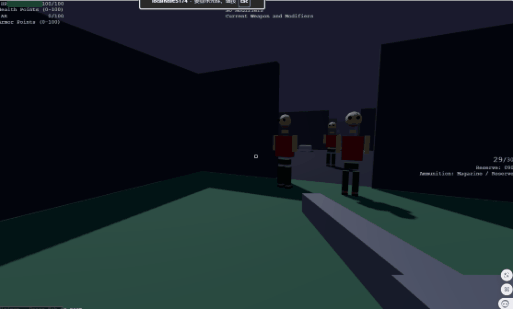
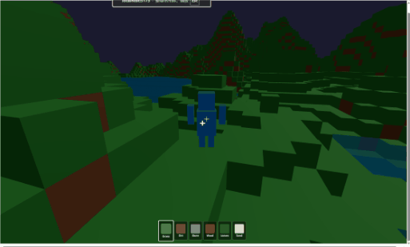
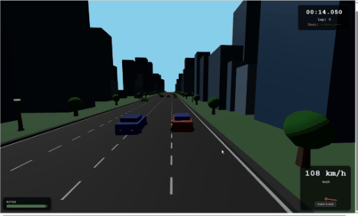
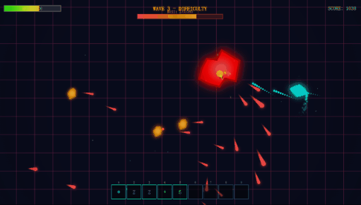

# Suity Agentic

[]()
[]()

**Suity** is a next-generation, professional-grade Agentic IDE designed for architecting and executing complex, industrial-scale autonomous AI systems. Moving beyond fragile static prompt chains and the chaotic unpredictability of open "Agent Teams," Suity pioneers the **DSAL (Deterministic Skeleton with Autonomous Loops)** paradigm. By combining high-performance node-based orchestration, strict hierarchical delegation, and atomic self-healing micro-loops, Suity turns unpredictable AI behaviors into reliable, production-ready software engineering workflows.

---

## Table of Contents

- [Overview](#overview)
- [The DSAL Architecture](#the-dsal-architecture)
- [Highlights](#highlights)
- [Key Features](#key-features)
- [Architecture](#architecture)
- [Getting Started](#getting-started)
- [Cross-Platform Status](#cross-platform-status)
- [Building from Source](#building-from-source)
- [Documentation](#documentation)
- [Contributing](#contributing)
- [License](#license)

---

## Overview

**Suity** bridges the gap between high-level AI orchestration and rigorous system engineering. It is a professional development environment that empowers developers to transition from "Prompt Engineering" to **"Loop Engineering."**

- 🕸️ **Visual DSAL Graph Editor** — A high-performance, immediate-mode flowchart editor. Design the deterministic macroscopic pipeline while encapsulating autonomous AI loops inside individual nodes.
- 🚀 **Strict Hierarchical Multi-Agent Network** — Build deeply nested "Manager-Worker" hierarchies. Eliminate horizontal agent-to-agent cross-talk and infinite debate loops through top-down delegation and bottom-up reporting.
- 🔁 **Atomic Loop Engineering** — Break complex tasks into isolated micro-loops (e.g., Code -> Compile -> Test -> Fix) with strictly bounded contexts and token-limit circuit breakers.
- 📄 **Task Page & State Persistence** — Monitor the operational flow of every loop iteration in real-time. Trace execution lineage, inspect context states, and perform surgical rollbacks without losing macroscopic progress.
- 📦 **Agent Prefab System** — Package complex Loop matrices into reusable, shareable modules.
- 🌐 **Cross-Platform Architecture** — Powered by **Avalonia UI** and **.NET 10** for seamless cross-platform deployment (Windows, Linux, macOS).
- 🎨 **Native C# ImGui Framework** — A proprietary, high-performance GUI system written in pure C#, enabling fluid visual node rendering for massive AI workflows.

---

## Screenshots

### Landing Page


### First Person Shooter


### Minecraft Clone


### Racing 3D


### Space Shooter 2D


### Tank 3D


---

## The DSAL Architecture

Suity introduces the **Deterministic Skeleton with Autonomous Loops (DSAL)** model, solving the industry's core dilemma: balancing the reliability of traditional CI/CD pipelines with the cognitive flexibility of AI.

1. **Layer 1: Deterministic Global Backbone (The Skeleton)**
   The macroscopic workflow (e.g., *Requirements -> Tech Spec -> Architecture -> UI -> QA*) is strictly defined via the visual node graph. This prevents AI from skipping critical engineering phases and guarantees directional progress.
2. **Layer 2: Agent Boundary & Constraints (The Isolation)**
   Agents do not chat freely. The Manager Agent delegates isolated tasks to specialized Worker Agents (Planner, Coder, Verifier). Each worker is sandbox-jailed with only the exact context required for its task, eliminating context pollution and "attention haystack" effects.
3. **Layer 3: Local Micro-Loops (The Autonomy)**
   Within a specialized task node, the Agent is given 100% freedom to self-heal. A Coder Agent executing a *Business Logic Task* will run internal `Generate -> Test -> Fix` loops until it passes semantic validation or hits a token threshold, driving the system to local optima.

---

## Highlights

### 🕸️ Visual Loop Orchestration
Design industrial AI factories visually. Suity’s node-graph isn't just for data flow; it defines the management structure.
* **Dual-Axis Routing**: Connect nodes horizontally to define strict lifecycle pipelines (DAG), and vertically to define hierarchical agent delegation trees.
* **Matrix Fan-Out**: Instantly fan-out a single Tech Spec into dozens of parallel QA Checklist verification loops, maximizing CI/CD throughput.
* **Visual Rollback & Context Passing**: When a downstream UI loop fails, trace the error signal directly back to the Architecture node, injecting the specific critique for a surgical, state-safe rebuild.

### 🚀 Hierarchical Multi-Subagent (The "Matryoshka" Pattern)
Break away from monolithic agents. Suity allows you to architect deeply nested agent hierarchies.
* **Manager-Worker Delegation**: Top-level agents act as routers and planners, delegating specific sub-tasks to specialized micro-agents. 
* **Zero Horizontal Friction**: By enforcing vertical reporting, Suity entirely eliminates the token-wasting "infinite debate" often seen in unstructured Agent Teams.

### 🔍 White-box "Task Page" Debugging
Say goodbye to opaque chat logs. Suity introduces **Task Pages**—a dedicated, real-time visual interface representing the software operation process.
* **Loop Iteration Tracking**: Watch a single task iterate through its verification loop. Monitor token spend, step status (`DONE`, `FAILED`), and retry counts in real-time.
* **Isolated State Snapshots**: If an Agent corrupts its output on Loop 4, instantly scrub the memory and revert its context sandbox to Loop 2 via Git-based state integration.

### 📦 Agent Prefabs (Modular Reusability)
Inspired by modern game engines, Suity treats agent logic as **Prefabs**. 
* **Encapsulation**: Package a complex multi-agent verification tree (e.g., a "Security Auditor Matrix") into a single, reusable asset.
* **Standardized Interfaces**: Prefabs define clear input/output contracts (Data Ports and Signal Ports), making team collaboration seamless.

### 📦 Unified Asset Manager
All AI development assets are centrally managed through a powerful system designed for complex project scale.
* **Centralized Hub & Reference Tracking**: Workflows, Prompts, and Knowledge Bases use GUID-based identification. Visual indicators show exactly how many workflows depend on a specific asset.
* **Background Issue Analysis**: Continuously detects broken references and configuration conflicts in real-time.

---

## Key Features

### Core Framework
- **Reactive Data Tree** — Hierarchical data storage with computed properties, change notifications, and before/after listener mechanisms.
- **Dependency Injection** — Full DI container with singleton/transient resolution, supporting Handler, Producer, Reducer, Mediator, and Assembler patterns.
- **High-Performance Collections** — Object pools, capped arrays, word trees, range collections, and concurrent data structures tailored for high-frequency AI loop execution.

### Graphics & UI
- **Native C# ImGui Framework** — A proprietary immediate-mode GUI system independently developed in pure C#. Eliminates retained-mode state friction, accelerating tool development.
- **Cross-Platform Rendering** — Natively supports SkiaSharp and Avalonia UI backends, ensuring smooth visual flowcharts with thousands of active loop instances.
- **Professional Editor Views** — Inspector View (property grids), TreeView (virtual multi-column layouts), and Node Graph View with connectors, grouping, and real-time execution animation.

### AI Integration
- **Multi-Provider LLM Support** — OpenAI, DeepSeek, Alibaba DashScope, SiliconFlow, AIHubMix, OpenRouter, and local LM Studio.
- **Dual-Track Semantic Validation** — Built-in support for runtime execution checks alongside LLM-driven semantic compliance auditing against technical specs.
- **RAG Knowledge Base** — Retrieval-Augmented Generation with both vector and graph retrieval modes for context-injection into specific task loops.

---

## Architecture

Suity follows a layered, modular architecture:

```text
┌─────────────────────────────────────────────────────────┐
│                    Suity.Agentic                         │
│              (Cross-Platform Editor App)                 │
├─────────────────────────────────────────────────────────┤
│              Suity.Editor.AIGC                           │
│         (DSAL Orchestrator & Loop Engine)                │
├─────────────────────────────────────────────────────────┤
│                  Suity.Editor                            │
│          (Visual Editor Framework Core)                  │
├──────────────┬──────────────┬───────────────────────────┤
│  Suity.ImGui │ Suity.Rex    │    Suity.DataSync         │
│  (GUI Frame) │ (Reactive)   │    (Data Sync)            │
├──────────────┴──────────────┴───────────────────────────┤
│                    Suity                                 │
│              (Core Foundation Library)                   │
└─────────────────────────────────────────────────────────┘
···

---

## Getting Started

### Prerequisites

- [.NET SDK](https://dotnet.microsoft.com/download) (Requires **.NET 10** for the main application; core libraries target .NET Standard 2.0)
- An IDE such as [Visual Studio](https://visualstudio.microsoft.com/), [Visual Studio Code](https://code.visualstudio.com/), or [JetBrains Rider](https://www.jetbrains.com/rider/)

### Quick Start

1. **Clone the repository**
   ```bash
   git clone https://github.com/suitylab/Suity.git
   cd SuityOpenSource
   ```

2. **Restore dependencies**
   ```bash
   dotnet restore
   ```

3. **Build the solution**
   ```bash
   dotnet build
   ```

4. **Run the editor application**
   ```bash
   dotnet run --project src/Suity.Agentic
   ```

---

## Cross-Platform Status

### Current State

This application has been ported from the native **Windows platform** to **Avalonia UI** with the goal of supporting full cross-platform capabilities.

### Important Notes

- **System.Drawing.Common Dependency**: The application currently retains its dependency on `System.Drawing.Common`. This library is explicitly marked with `CA1416` - only supported on "Windows" 6.1 and later versions.
- **Future Work**: Additional effort is required to fully achieve cross-platform compatibility. The `System.Drawing.Common` dependency needs to be replaced with a custom data abstraction layer to ensure proper functionality on Linux and macOS.

---

## Building from Source

```bash
# Restore all NuGet packages
dotnet restore

# Build all projects
dotnet build --configuration Release

# Run tests (if available)
dotnet test

# Publish for a specific runtime
dotnet publish src/Suity.Agentic -c Release -r win-x64 --self-contained
```

---

## Documentation

Detailed documentation for each module can be found in their respective `README.md` files within the `src/` directory. Key documentation includes:

- [Suity Core Framework](src/Suity/README.md)
- [Suity.Rex Reactive Framework](src/Suity.Rex/README.md)
- [Suity.ImGui GUI Framework](src/Suity.ImGui/README.md)
- [Suity.Editor Framework](src/Suity.Editor/README.md)
- [Suity.Editor.AIGC AI Integration](src/Suity.Editor.AIGC/README.md)
- [Suity.Agentic Application](src/Suity.Agentic/README.md)

---

## Contributing

We welcome contributions! Please follow these steps:

1. Fork the repository
2. Create your feature branch (`git checkout -b feature/amazing-feature`)
3. Commit your changes (`git commit -m 'Add some amazing feature'`)
4. Push to the branch (`git push origin feature/amazing-feature`)
5. Open a Pull Request

Please ensure your code follows the existing code style and includes appropriate tests.

---

## License

Suity is licensed under a **modified version of the Apache License 2.0**, with additional conditions.

### 📜 Summary of Terms

* **Free for Individuals & Enterprises**: You can freely use, modify, and self-host Suity for internal business logic and personal projects.
* **Commercial Restrictions**: A commercial license must be obtained from Suity if any of the following conditions are met:
    * **Multi-tenant Service**: Unless explicitly authorized in writing, you may not use the Suity source code to operate a multi-tenant environment (e.g., providing a public "Agent-as-a-Service" cloud platform).
    * **Public Cloud & Remote AI Deployment**: Unless explicitly authorized in writing, you may not deploy, operate, or provide any AI computing services (including but not limited to model inference, fine-tuning, or agent execution) powered by or based on Suity in a public cloud, remote server, or managed service environment for third parties.
    * **Commercial Asset Sales Prohibition**: Unless explicitly authorized in writing, you may not sell, distribute for a fee, or commercially license any asset packs, templates, workflows, or extension packages designed for Suity to any third party.
    * **LOGO and Copyright Information**: You may not remove or modify the LOGO or copyright information in the Suity application icon, startup/splash screen, main menu bar, and 'about us' window.
* **Contributor Agreement**: By contributing to this repository, you agree that:
    * Suity reserves the right to adjust license terms to be more strict or relaxed as deemed necessary.
    * Suity may use contributed code for commercial purposes, including but not limited to Suity's cloud business operations.

Apart from the specific conditions mentioned above, all other rights and restrictions follow the **Apache License 2.0**. Detailed information can be found at [http://www.apache.org/licenses/LICENSE-2.0](http://www.apache.org/licenses/LICENSE-2.0).

> **Note**: The interactive design (including the Node-Graph, Agent Prefab architecture, and Task Page layout) of this product is protected by appearance patent and trade secret laws.
>
> © 2026 Suity. All rights reserved.

---

## Acknowledgments

### Third-Party Libraries

- [Crypto.Client](src/Crypto.Client/) - C# encryption utility library supporting AES, DES, RSA, MD5, SHA1 algorithms
- [OpenAI_API](src/OpenAI_API/) - C#/.NET SDK library for accessing OpenAI GPT-3 API, ChatGPT, and DALL-E 2

### Open Source Dependencies

- [Avalonia UI](https://avaloniaui.net/) - Cross-platform UI framework
- [SkiaSharp](https://github.com/mono/SkiaSharp) - 2D graphics rendering
- [LiteDB](https://www.litedb.org/) - Embedded NoSQL database
- [BouncyCastle](https://www.bouncycastle.org/) - Cryptography library
- [Newtonsoft.Json](https://www.newtonsoft.com/json) - JSON serialization
