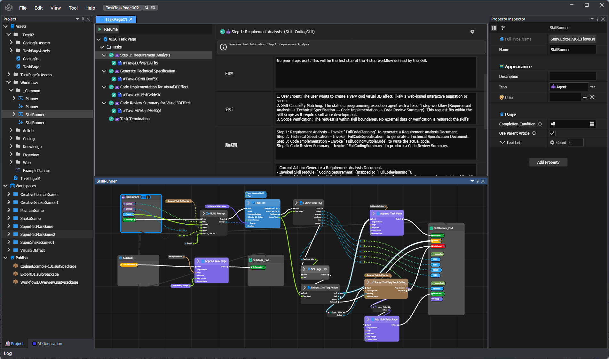

# Suity Agentic

[]()
[]()

**Suity** is a next-generation, professional-grade Agentic IDE for architecting and executing complex, multi-layered autonomous AI systems. Moving beyond fragile prompt chains, Suity introduces a "White-box" engineering paradigm—combining high-performance node-based orchestration, hierarchical sub-agent nesting, and deep state-traceability to turn unpredictable AI behaviors into reliable, production-ready workflows.

---

## Table of Contents

- [Overview](#overview)
- [Highlights](#highlights)
- [Key Features](#key-features)
- [Architecture](#architecture)
- [Project Structure](#project-structure)
  - [Core Framework](#core-framework)
  - [Graphics & UI](#graphics--ui)
  - [Editor Framework](#editor-framework)
  - [Editor UI Components](#editor-ui-components)
  - [AIGC (AI Generated Content)](#aigc-ai-generated-content)
  - [Application](#application)
- [Getting Started](#getting-started)
- [Cross-Platform Status](#cross-platform-status)
- [Building from Source](#building-from-source)
- [Documentation](#documentation)
- [Contributing](#contributing)
- [License](#license)

---

## Overview

**Suity** bridges the gap between high-level AI orchestration and low-level system engineering. It is a professional-grade development environment that empowers developers to move from "Prompt Engineering" to **"Agentic Engineering."**

- 🕸️ **Visual Node-Graph Editor** — A high-performance, immediate-mode flowchart editor designed for massive AI workflows. Supports real-time data flow monitoring and visual debugging.
- 🚀 **Hierarchical Agent Design** — Build deeply nested **Multi-Subagent** systems. Each agent can orchestrate its own sub-tasks, creating a scalable "Manager-Worker" hierarchy for complex problem-solving.
- 📄 **Task Page & State Persistence** — Every agent run is a "Task Page." Monitor execution history, sub-task outputs, and retry failed nodes with complete state persistence.
- 📦 **Agent Prefab System** — Package your agent logic into reusable, shareable modules. Build a library of specialized AI skills and deploy them across different workspaces.
- 🌐 **Cross-Platform Architecture** — The main application leverages **Avalonia UI** and **.NET 10** for seamless cross-platform deployment (Windows, Linux, macOS), while core libraries remain compatible with .NET Standard 2.0.
- 🎨 **Native C# ImGui Framework** — A proprietary, high-performance GUI system. Written in pure C#, it eliminates the friction between UI design and backend logic, enabling professional-grade tool development.

---

## Screenshots



---

## Highlights

Suity is built on the philosophy of **"Agentic Engineering."** We believe that complex AI systems should be as structured, traceable, and reusable as modern software architecture.

### 🕸️ Node-Graph Based AI Workflow
Design and orchestrate complex AI systems visually. Suity's powerful node-graph editor provides a flexible canvas for building agentic workflows.
* **Low-Code Development**: Empower users to build sophisticated and diverse AI workflows entirely through visual configuration, eliminating the need for traditional coding.
* **Visual Node-Graph Editing**: Intuitive drag-and-drop interface for constructing complex logic flows.
* **Quick Extraction**: Instantly convert selected node clusters into reusable functions or standalone agent flows.
* **Stacked Multi-Level Views**: Select a function node directly from the current view to in-place expand its sub-flowchart, supporting multiple levels of nested expansion without losing context.
* **Runtime Visual Debugging**: Monitor data flow and execution states in real-time directly on the canvas.
* **Automatic Type Conversion**: Intelligent type inference and conversion between connected nodes, reducing boilerplate configuration.
* **Dual Execution Modes**: Fully supports both **Action Flow** (control flow) and **Data Flow** paradigms for maximum flexibility.

### 🚀 Hierarchical Multi-Subagent (The "Matryoshka" Pattern)
Break away from monolithic prompt chains. Suity allows you to architect deeply nested agent hierarchies where a "Manager" agent can orchestrate multiple "Sub-agents." Each sub-agent is a specialized unit with its own model configuration, prompt context, and isolated toolset, enabling complex problem-solving through modular delegation.

### 🧠 Multiple AI Agent Programming Paradigms
Suity supports a wide range of mainstream AI agent paradigms, allowing you to develop the best architecture for your specific task:
* **ReAct (Reasoning + Acting)**: Interleave reasoning traces and action steps for dynamic decision-making.
* **Plan-and-Execute**: Separate high-level planning from low-level execution for complex, multi-step tasks.
* **Multi-Agent Collaboration**: Enable multiple specialized agents to debate, collaborate, and vote on outcomes.
* **Reflection & Self-Correction**: Agents that can review their own outputs, identify errors, and iteratively improve.
* **Tool Use & Function Calling**: Seamless integration of external APIs, databases, and code execution as tools.

### 🔍 White-box "Task Page" Debugging
Say goodbye to opaque chat logs. Suity introduces **Task Pages**—a dedicated, real-time visual interface for every agent execution. 
* **Full Transparency**: Inspect the internal state, variable values, and sub-task outputs of any agent at any step.
* **Interactive Intervention**: Pause, modify, and resume execution flows mid-stream.
* **Execution Lineage**: Trace every decision back to its source node, making "Black-box AI" a thing of the past.

### 🔗 Decoupled AI Workflow & Skill Prompts
Suity fundamentally separates the **execution logic** from the **skill definition**.
* **Workflow Reusability**: A single node-graph workflow can be dynamically bound to multiple different skill prompts.
* **Skill Sharing**: Swap out prompts to change an agent's behavior, tone, or domain expertise without touching the underlying logic.
* **Rapid Iteration**: Experiment with different prompt strategies on the exact same workflow architecture to find the optimal configuration.

### 📦 Agent Prefabs (Modular Reusability)
Inspired by modern game engines, Suity treats agent logic as **Prefabs**. 
* **Encapsulation**: Package complex node-graph logic (e.g., a "Security Auditor" or "Content Summarizer") into a single, reusable asset.
* **Drag-and-Drop Workflow**: Build your own library of specialized AI skills and deploy them across different projects or workspaces without rewriting code.
* **Standardized Interfaces**: Prefabs define clear input/output contracts, making team collaboration and agent sharing seamless.

### 💾 State-Isolated Execution & Persistence
Suity's core engine ensures that every agent task is state-aware and persistent.
* **Fault Tolerance**: If a long-running task is interrupted or a network call fails, Suity can resume exactly where it left off.
* **Snapshotting**: Save the complete state of an agentic workflow into a single document file—including its logic, data, and execution history—making AI workflows truly portable and reproducible.

### 📦 Unified Asset Manager
All your AI development assets are centrally managed through a powerful Asset Manager system designed for complex project scale.
* **Centralized Asset Hub**: Workflows, Prompts, Agents, Knowledge Bases, and Reference Articles are all unified under a single asset management system with GUID-based identification and metadata tracking.
* **Advanced Reference Tracking**: 
  * **Find References**: Instantly locate every usage of an asset across your entire project.
  * **Reference Counting**: Visual indicators show exactly how many workflows or agents depend on a specific asset, preventing accidental deletion of critical components.
* **Automatic Background Issue Analysis**: The Asset Manager continuously runs background analysis to detect broken references, circular dependencies, and configuration conflicts, providing real-time warnings and actionable suggestions to keep your project healthy.
* **Package Import & Export**: Easily share and distribute your AI assets with Suity's native package system (`.suitypackage` and `.suitylibrary`). Export complete workflows with all dependencies, or import community-created assets with automatic dependency resolution.

### 🗂️ Multi-Workspace Management
Suity's workspace system enables flexible project organization and cross-project collaboration.
* **Multiple External Folders**: Simultaneously import and edit multiple external working folders within a single editor instance. Each workspace maintains its own configuration, code repositories, and asset references.
* **Cross-Workspace Asset Sharing**: Reference assets across different workspaces without duplication, enabling team collaboration and modular project organization.
* **Independent Configuration**: Each workspace operates with isolated settings, render targets, and dependency graphs, ensuring clean separation between different projects or environments.

### 🛠️ Highly Customizable
Suity is designed to be extensible, allowing you to tailor the editor to your specific needs.
* **Plugin Architecture**: Easily extending editor functionality through a modular plugin system.
* **Custom Nodes**: Develop and integrate your own logic nodes to extend workflow capabilities.
* **New Document Types & Views**: Create specialized document types and custom views for unique data visualization and editing.
* **Custom Asset Types**: Define new asset types to manage domain-specific resources within the Asset Manager.
* **Extensible API Interfaces**: Add new API integrations to connect with external services and models.
* **Adaptable to Any Scenario**: Whether for game development, content creation, or enterprise automation, Suity's modular architecture adapts to diverse application scenarios.

## Key Features

### Product Paradigms

Suity is not just an editor; it's a new way of building autonomous AI systems. 

* **Hierarchical Multi-Subagent (The "Matryoshka" Pattern)** Break down monolithic AI tasks into manageable, nested sub-agents. Design complex "Agent-to-Agent" collaboration flows where each node can be a standalone sub-task with its own specialized model and prompt context. 
* **White-box "Task Page" Debugging** Move beyond opaque chat logs. Suity introduces "Task Pages"—a dedicated visual interface for every agent execution. Monitor sub-task submissions, inspect real-time variable states, and intervene in the execution flow with full transparency.
* **Agent Prefabs (Modular Reusability)** Suity allows you to encapsulate complex agent logic into "Prefabs." Build a "Code Reviewer Prefab" once, and drag-and-drop it into any new project as a modular component.
* **State-Isolated Execution** Each task execution is completely isolated. The state-persistence engine ensures that if a long-running agent crashes, it can be resumed from the exact point of failure without losing progress.

### Core Framework
- **Reactive Data Tree** — Hierarchical data storage with computed properties, change notifications, and before/after listener mechanisms
- **Dependency Injection** — Full DI container with singleton/transient resolution, supporting Handler, Producer, Reducer, Mediator, and Assembler patterns
- **Reactive Programming** — LINQ-like operator chains (Select, Where, Combine, Format) for event and reactive value monitoring
- **High-Performance Collections** — Object pools, capped arrays, word trees, range collections, and concurrent data structures
- **Comprehensive Reflection System** — Type resolution, description, derived type discovery, and instantiation for complex generic and nested types

### Graphics & UI
- **Native C# ImGui Framework** — A proprietary immediate-mode GUI system independently developed by the Suity team in pure C#. Unlike traditional retained-mode GUI frameworks, ImGui's immediate-mode paradigm allows developers to write UI code in a straightforward, declarative manner without managing complex view state, significantly accelerating graphical interface development.
- **Cross-Platform Rendering** — Natively supports SkiaSharp and Avalonia UI backends, enabling seamless deployment across Windows, Linux, and macOS with consistent rendering quality and performance.
- **Professional Editor Views Built with ImGui** — The entire editor UI is powered by the native ImGui system, including:
  - **Inspector View** — Full-featured property grid with multi-object editing, custom editor templates, and undo/redo integration
  - **TreeView View** — High-performance virtual tree with multi-column layout, drag-and-drop, inline editing, and keyboard navigation
  - **Node Graph View** — Visual node-based editor with connectors, grouping, annotations, zoom/pan, and custom node rendering
- **Rich Widget Library** — Buttons, text inputs, checkboxes, panels, scroll containers, virtual lists, sliders, color pickers, and more, all with chainable APIs
- **CSS-Like Styling System** — Selector-based styling (type name, class name, ID) with pseudo-states (hover, active) and transition animations with built-in easing functions
- **Virtual Rendering** — On-demand rendering strategy that only instantiates nodes within the visible region, ensuring smooth performance with thousands of items

### Editor Framework
- **Asset Management** — Complete resource lifecycle management with metadata tracking, reference resolution, and GUID-based identification
- **Workspace Management** — Multi-workspace support with independent code repositories, references, and render targets
- **Visual Flowchart Editor** — Node-graph-based visual programming with data flow and action flow execution modes
- **Code Generation Engine** — Transforms visual designs into actual code files with incremental rendering and user code protection
- **Type Design System** — Visual design of structs, enums, abstract types, events, and logic modules with field-level configuration
- **Undo/Redo System** — Complete operation history management with macro actions and value change tracking
- **Plugin Architecture** — Extensible plugin system for custom features and UI customization

### AI Integration
- **Multi-Provider LLM Support** — OpenAI, DeepSeek, Alibaba DashScope, SiliconFlow, AIHubMix, OpenRouter, and local LM Studio
- **Visual AI Workflow Designer** — Flowchart-based AI task orchestration with LLM nodes, article processing, prompt building, and web browsing
- **RAG Knowledge Base** — Retrieval-Augmented Generation with both vector and graph retrieval modes
- **AI Assistant System** — Canvas assistants, document assistants, generative assistants, and node graph assistants with intelligent routing
- **Task Management** — Hierarchical task pages with sub-task support, status tracking, and prompt passing

---

## Architecture

Suity follows a layered, modular architecture:

```
┌─────────────────────────────────────────────────────────┐
│                    Suity.Agentic                         │
│              (Cross-Platform Editor App)                 │
├─────────────────────────────────────────────────────────┤
│              Suity.Editor.AIGC                           │
│         (AI Workflow & Assistant System)                 │
├─────────────────────────────────────────────────────────┤
│                  Suity.Editor                            │
│          (Visual Editor Framework Core)                  │
├──────────────┬──────────────┬───────────────────────────┤
│  Suity.ImGui │ Suity.Rex    │    Suity.DataSync         │
│  (GUI Frame) │ (Reactive)   │    (Data Sync)            │
├──────────────┴──────────────┴───────────────────────────┤
│                    Suity                                 │
│              (Core Foundation Library)                   │
└─────────────────────────────────────────────────────────┘
```

---

## Project Structure

### Core Framework

| Project | Description |
|---------|-------------|
| **[Suity](src/Suity/)** | The foundational C# framework library providing object lifecycle management, high-performance collections, reflection utilities, logging, localization, conversation systems, and network abstractions. Serves as the base layer for all other Suity components. |
| **[Suity.Rex](src/Suity.Rex/)** | A reactive data management and dependency injection framework. Features a tree-based data structure (RexTree/RexNode) with path-based navigation (RexPath), computed properties, change notifications, and a full DI container supporting multiple patterns (Handler, Producer, Reducer, Mediator, Assembler). |
| **[Suity.DataSync](src/Suity.DataSync/)** | A comprehensive data synchronization and serialization library. Provides object data sync, serialization/deserialization, cloning, and traversal mechanisms through `ISyncObject` and `ISyncList` interfaces. Includes binary I/O, JSON/BSON processing, LZ4 compression, and node query systems. |

### Graphics & UI

| Project | Description |
|---------|-------------|
| **[Suity.Graphics](src/Suity.Graphics/)** | The foundational UI rendering and interaction abstraction layer. Provides platform-independent interfaces for graphics rendering, color configuration, context management, drawing operations, drag-and-drop, and hierarchical menu command systems. |
| **[Suity.ImGui](src/Suity.ImGui/)** | A proprietary immediate-mode GUI framework independently developed by the Suity team in pure C#. Built on a node-tree architecture with four extensible systems (Input, Layout, Fit, Render), it enables rapid and intuitive UI development through its immediate-mode paradigm—developers write UI code directly without managing complex view state. Features a rich widget library with chainable APIs, CSS-like styling with pseudo-states and animations, virtual lists, tree views, and native control embedding support. |
| **[Suity.ImGui.BuildIn](src/Suity.ImGui.BuildIn/)** | The built-in implementation library for the ImGui framework. Provides complete property grids (Inspector View), tree views with multi-column support (TreeView View), node graph/flowchart editors (Node Graph View), animation systems with easing functions, and a comprehensive style/theme system. |
| **[Suity.ImGui.Avalonia](src/Suity.ImGui.Avalonia/)** | Cross-platform graphics rendering library that natively integrates the Suity ImGui framework with Avalonia UI. Powered by SkiaSharp for high-performance 2D drawing with double/single buffering, partial repaint optimization, rich text rendering, menu systems, drag-and-drop, and color pickers. Provides seamless cross-platform deployment on Windows, Linux, and macOS. |

### Editor Framework

| Project | Description |
|---------|-------------|
| **[Suity.Editor](src/Suity.Editor/)** | The core visual editor framework. Provides asset management (data tables, images, libraries, values), flowchart editing, code rendering engine, type design system, workspace management, service architecture (dialogs, clipboard, navigation, analysis, localization), undo/redo system, and plugin extensibility. |
| **[Suity.Editor.Internal](src/Suity.Editor.Internal/)** | The internal core implementation library for the Suity editor. Features a plugin-based architecture with CorePlugin as the entry point, project/workspace management, asset and document management, type reflection system (NativeTypeReflector mapping .NET types to DType), ImGui-based tree views and property inspectors, analysis services, internationalization, and encryption utilities. |

### Editor UI Components

| Project | Description |
|---------|-------------|
| **[Suity.Editor.ImGui](src/Suity.Editor.ImGui/)** | ImGui-based editor UI component library. Includes tree view systems (basic, path-based, column layout), property editing with multi-object support and custom editor templates, flowchart rendering with node frames and connectors, log console with level filtering, and document management with XML output. |
| **[Suity.Editor.VirtualTree](src/Suity.Editor.VirtualTree/)** | A flexible, extensible virtual tree component library for property tree editing. Features adapter-based node system mapping various data sources to virtual tree nodes, priority-driven node creation, complete undo/redo support, rich node types (object, list, string), sync mechanism integration, ImGui rendering customization, and state persistence. |
| **[Suity.Editor.ProjectGui](src/Suity.Editor.ProjectGui/)** | The project view module providing an ImGui-based tree file browser for managing and navigating project assets, workspaces, and publish directories. Supports right-click menu operations (create/delete/rename files, import/export packages, find references, publish assets), PathNode architecture for different file types, and drag-and-drop operations. |
| **[Suity.Editor.Documents](src/Suity.Editor.Documents/)** | Document management module with visual data structure design (structs, enums, abstract types, events, logic modules), refactoring tools (field extraction, structure folding), article management with Markdown import, external document parsing (Excel, Word, PDF), and AI prompt template documents. |
| **[Suity.Editor.Flows](src/Suity.Editor.Flows/)** | A visual flowchart editing and execution framework based on ImGui node graph architecture. Supports data flow and action flow execution modes, sync/async dual-mode computation engine, built-in node library (math, strings, logic control, loops, JSON parsing, data tables), undo/redo, sub-flow nesting, clipboard operations, and type-safe connector system. |
| **[Suity.Editor.CodeRender](src/Suity.Editor.CodeRender/)** | Code rendering and generation library featuring JavaScript parsing (full ECMAScript lexer and parser to AST), AST-based code rendering for multiple target languages, expression system converting editor objects to expression nodes, dynamic proxy template system, code segment parsing with user code protection, and LiteDB-based encrypted local code database. |
| **[Suity.Editor.Packaging](src/Suity.Editor.Packaging/)** | Package management plugin module supporting standard Suity packages (`.suitypackage`) and library packages (`.suitylibrary`). Features export with dependency collection and GUID replacement, import with batch loading and workspace auto-creation, and an ImGui-based tree preview dialog with file selection and status indicators. |

### AIGC (AI Generated Content)

| Project | Description |
|---------|-------------|
| **[Suity.Editor.AIGC](src/Suity.Editor.AIGC/)** | The core AIGC framework providing LLM service abstraction, multi-type AI assistants (canvas, document, generative, node graph), RAG knowledge base with vector and graph retrieval, tool calling system, workflow-based AI task orchestration, and comprehensive prompt configuration system for classification, extraction, generation, and knowledge base queries. |
| **[Suity.Editor.AIGC.API](src/Suity.Editor.AIGC.API/)** | API plugin module for integrating third-party AI LLM and image generation models. Based on OpenAI-compatible protocol, supports OpenAI, DeepSeek, Alibaba DashScope, SiliconFlow, AIHubMix, OpenRouter, and local LM Studio. Features dynamic model list caching, streaming/non-streaming responses, tool calling, and visual plugin configuration. |
| **[Suity.Editor.AIGC.Flows](src/Suity.Editor.AIGC.Flows/)** | AIGC workflow module providing visual flowchart-based AI workflow design and execution. Supports LLM call nodes, article processing, prompt building, XML parsing, web browsing, hierarchical task management with sub-tasks, model selection, function calling, output validation, retry logic, and canvas document types. |
| **[Suity.Editor.AIGC.LLm](src/Suity.Editor.AIGC.LLm/)** | LLM integration module providing AI assistant system for article generation, optimization, summarization, and segmentation. Features Mermaid diagram (flowchart, mind map) AI generation and rendering, multi-tier LLM model configuration, preset model types (chat, creative writing, code generation), and unified chat tool window interface. |

### Application

| Project | Description |
|---------|-------------|
| **[Suity.Agentic](src/Suity.Agentic/)** | A cross-platform editor application built on Avalonia UI, implementing a full-featured Agentic Workflow Editor (v2026.01a). Features dockable interface system via Dock.Avalonia, document management with AvaloniaEdit (syntax highlighting, code folding), ImGui-style startup screen, unified service architecture via AvaEditorDevice, complete menu system, cross-platform support (Windows/Linux/macOS), and fuzzy search integration. |

---

## Getting Started

### Prerequisites

- [.NET SDK](https://dotnet.microsoft.com/download) (Requires **.NET 10** for the main application; core libraries target .NET Standard 2.0)
- An IDE such as [Visual Studio](https://visualstudio.microsoft.com/), [Visual Studio Code](https://code.visualstudio.com/), or [JetBrains Rider](https://www.jetbrains.com/rider/)

### Quick Start

1. **Clone the repository**
   ```bash
   git clone https://github.com/suitylab/Suity.git
   cd SuityOpenSource
   ```

2. **Restore dependencies**
   ```bash
   dotnet restore
   ```

3. **Build the solution**
   ```bash
   dotnet build
   ```

4. **Run the editor application**
   ```bash
   dotnet run --project src/Suity.Agentic
   ```

---

## Cross-Platform Status

### Current State

This application has been ported from the native **Windows platform** to **Avalonia UI** with the goal of supporting full cross-platform capabilities.

### Important Notes

- **System.Drawing.Common Dependency**: The application currently retains its dependency on `System.Drawing.Common`. This library is explicitly marked with `CA1416` - only supported on "Windows" 6.1 and later versions.
- **Future Work**: Additional effort is required to fully achieve cross-platform compatibility. The `System.Drawing.Common` dependency needs to be replaced with a custom data abstraction layer to ensure proper functionality on Linux and macOS.

---

## Building from Source

```bash
# Restore all NuGet packages
dotnet restore

# Build all projects
dotnet build --configuration Release

# Run tests (if available)
dotnet test

# Publish for a specific runtime
dotnet publish src/Suity.Agentic -c Release -r win-x64 --self-contained
```

---

## Documentation

Detailed documentation for each module can be found in their respective `README.md` files within the `src/` directory. Key documentation includes:

- [Suity Core Framework](src/Suity/README.md)
- [Suity.Rex Reactive Framework](src/Suity.Rex/README.md)
- [Suity.ImGui GUI Framework](src/Suity.ImGui/README.md)
- [Suity.Editor Framework](src/Suity.Editor/README.md)
- [Suity.Editor.AIGC AI Integration](src/Suity.Editor.AIGC/README.md)
- [Suity.Agentic Application](src/Suity.Agentic/README.md)

---

## Contributing

We welcome contributions! Please follow these steps:

1. Fork the repository
2. Create your feature branch (`git checkout -b feature/amazing-feature`)
3. Commit your changes (`git commit -m 'Add some amazing feature'`)
4. Push to the branch (`git push origin feature/amazing-feature`)
5. Open a Pull Request

Please ensure your code follows the existing code style and includes appropriate tests.

---

## License

Suity is licensed under a **modified version of the Apache License 2.0**, with additional conditions.

### 📜 Summary of Terms

* **Free for Individuals & Enterprises**: You can freely use, modify, and self-host Suity for internal business logic and personal projects.
* **Commercial Restrictions**: A commercial license must be obtained from Suity if any of the following conditions are met:
    * **Multi-tenant Service**: Unless explicitly authorized in writing, you may not use the Suity source code to operate a multi-tenant environment (e.g., providing a public "Agent-as-a-Service" cloud platform).
    * **Public Cloud & Remote AI Deployment**: Unless explicitly authorized in writing, you may not deploy, operate, or provide any AI computing services (including but not limited to model inference, fine-tuning, or agent execution) powered by or based on Suity in a public cloud, remote server, or managed service environment for third parties.
    * **Commercial Asset Sales Prohibition**: Unless explicitly authorized in writing, you may not sell, distribute for a fee, or commercially license any asset packs, templates, workflows, or extension packages designed for Suity to any third party.
    * **LOGO and Copyright Information**: You may not remove or modify the LOGO or copyright information in the Suity application icon, startup/splash screen, main menu bar, and 'about us' window.
* **Contributor Agreement**: By contributing to this repository, you agree that:
    * Suity reserves the right to adjust license terms to be more strict or relaxed as deemed necessary.
    * Suity may use contributed code for commercial purposes, including but not limited to Suity's cloud business operations.

Apart from the specific conditions mentioned above, all other rights and restrictions follow the **Apache License 2.0**. Detailed information can be found at [http://www.apache.org/licenses/LICENSE-2.0](http://www.apache.org/licenses/LICENSE-2.0).

> **Note**: The interactive design (including the Node-Graph, Agent Prefab architecture, and Task Page layout) of this product is protected by appearance patent and trade secret laws.
>
> © 2026 Suity. All rights reserved.

---

## Acknowledgments

### Third-Party Libraries

- [Crypto.Client](src/Crypto.Client/) - C# encryption utility library supporting AES, DES, RSA, MD5, SHA1 algorithms
- [OpenAI_API](src/OpenAI_API/) - C#/.NET SDK library for accessing OpenAI GPT-3 API, ChatGPT, and DALL-E 2

### Open Source Dependencies

- [Avalonia UI](https://avaloniaui.net/) - Cross-platform UI framework
- [SkiaSharp](https://github.com/mono/SkiaSharp) - 2D graphics rendering
- [LiteDB](https://www.litedb.org/) - Embedded NoSQL database
- [BouncyCastle](https://www.bouncycastle.org/) - Cryptography library
- [Newtonsoft.Json](https://www.newtonsoft.com/json) - JSON serialization
